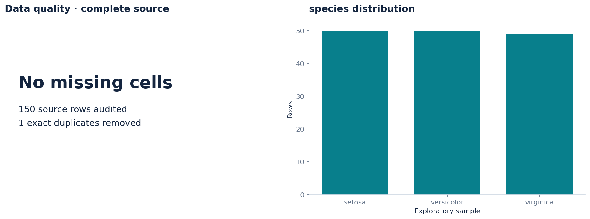
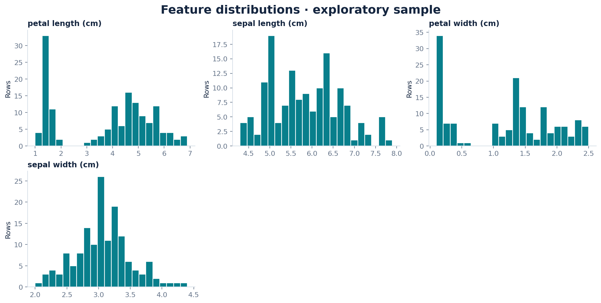
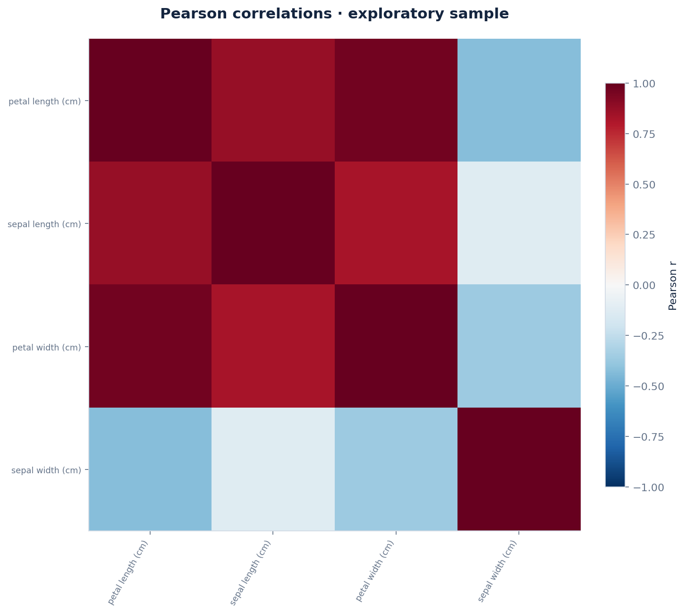

# Iris Species Exploratory Data Analysis

Exploratory study investigating morphological variance, class separability, and pairwise feature associations across Iris flower species.

---

## Overview

* **Task:** Morphological exploratory analysis and class distribution evaluation.
* **Dataset:** 149 usable records across 3 species with 4 continuous measurements (1 duplicate removed).
* **Key Finding:** Strong positive linear association between petal length and petal width ($\vert{}r\vert{} = 0.963$).
* **Focus:** Data quality checks, distribution profiling, and pairwise collinearity.

---

## Data Summary

* **Source:** [UCI Machine Learning Repository — Iris Dataset](https://archive.ics.uci.edu/dataset/53/iris) (CC BY 4.0)
* **Dimensions:** 149 usable rows, 4 numeric features, 0 missing values.
* **Features Analyzed:** Sepal length, sepal width, petal length, and petal width (all in cm).

---

## Visualizations

| Data Quality & Target Distribution | Feature Distributions |
| :---: | :---: |
|  |  |

| Pairwise Feature Correlations |
| :---: |
|  |

---

## Repository Structure

```text
├── figures/                   # Quality, distribution, and correlation plots
├── analysis.ipynb             # Interactive walk-through of morphological patterns
├── audit.json                 # Execution environment and dataset fingerprint
├── data_dictionary.csv        # Feature types, bounds, and null counts
├── descriptive_statistics.csv # Summary metrics across all features
├── metrics.json               # Pipeline checks and data quality metrics
└── README.md
